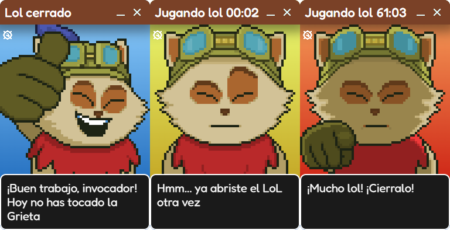

# Lol Detector



**Lol Detector** es una aplicación sencilla que detecta cuándo estás jugando _League of Legends_ y te avisa cuando llevas demasiado tiempo jugando, para que no te atrape el juego succiona-almas.

Fue creada como un proyecto personal para aprender a usar el framework **Electron JS**.

---

## Requisitos 🛠️

Antes de ejecutar este proyecto, asegúrate de tener instalado lo siguiente en tu sistema:

- [Node.js](https://nodejs.org/) (recomendado: v18 o superior)
- [npm](https://www.npmjs.com/) (viene incluido con Node.js)
- [Git](https://git-scm.com/) (opcional, para clonar el repositorio)

---

## Tecnologías utilizadas ⚙️

- **Electron JS**: Framework para crear aplicaciones de escritorio usando tecnologías web como HTML, CSS y JavaScript.

- **Electron-store**: Paquete que permite guardar y leer configuraciones o datos persistentes en aplicaciones Electron de forma sencilla.

---

## Instalación 💻

1. Clona este repositorio:
   ```bash
   git clone https://github.com/tu-usuario/lol-detector.git
   ```

## Instalación 💻

1. Clona este repositorio:
   ```bash
   git clone https://github.com/Pex-Dev/lol_detector
   ```
2. Entra al proyecto
   ```bash
    cd lol_detector
   ```
3. Instalar dependencias
   ```bash
    npm install
   ```
4. Inicia la aplicación:
   ```bash
    npm run dev
   ```
